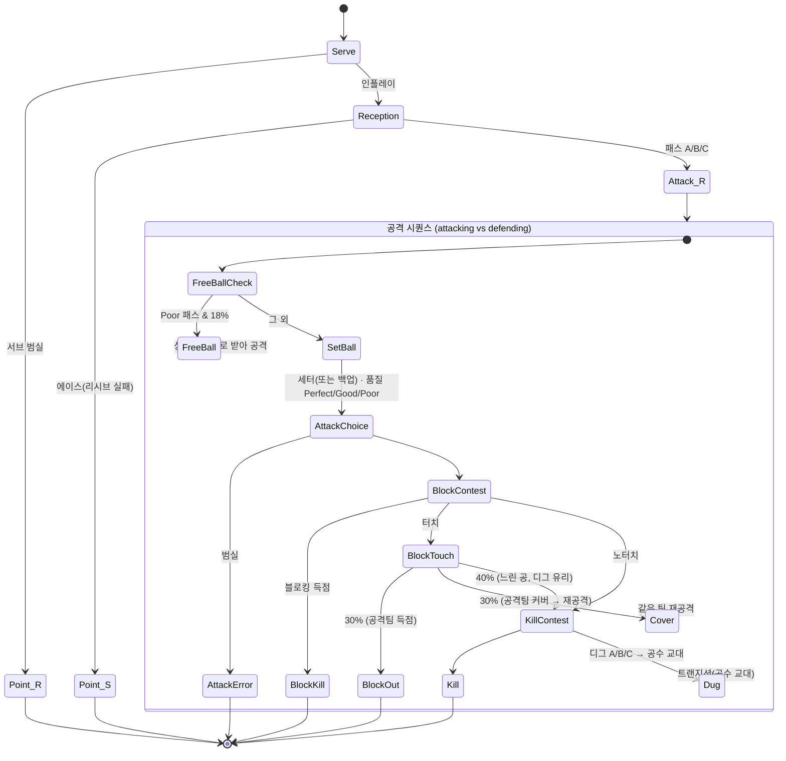

# 경기 시뮬레이션 상세 설계 (match-sim v0.1)

> 상태: 프로토타입 구현 완료(`sim/`), 몬테카를로 캘리브레이션 4차(최종) 반영. 이 문서의 상수는 `SimConfig` 기본값과 일치한다.
> 관련 문서: [GDD.md](GDD.md) 2절(스탯/포지션), 4절(로테이션), 5절(경기 시뮬), 11절(기술 스택) · 밸런스 결과: [match-sim-balance-report.md](match-sim-balance-report.md)

---

## 0. 한 줄 요약

서브 → 리시브 → 세트 → 공격 → 블로킹/디그 → (트랜지션 반복)의 **터치 단위 판정 체인**으로 랠리 하나를 결정하고, 그것을 랠리포인트·로테이션·리베로·5세트 규칙 위에서 반복한다. 모든 판정은 `P = sigmoid(logit(base) + (A − B)/k + 보정)` 한 가지 꼴이며, 모든 상수는 `SimConfig` 한 곳에 있다. 같은 입력 + 같은 시드 = 같은 결과(서버/클라이언트 동일 재현).

---

## 1. 목표와 설계 원칙

| 원칙 | 구현 |
|---|---|
| 랠리 단위, 터치마다 판정 | `RallyEngine` — 각 단계 결과(리시브 A/B/C 등)가 다음 단계의 확률·선택지를 제한 |
| 배구 규칙 재현 | 5세트 3선승 · 25점(5세트 15점) · 2점차 · 시계방향 로테이션 · 전위/후위 · 리베로 규칙 · 교체 한도(6회) |
| 엔진 비의존 순수 C# | `VolleySim.Core` = netstandard2.1, NuGet/Unity API 참조 없음 → Unity 클라이언트와 .NET 서버가 동일 어셈블리 사용 |
| 결정성 | 자체 xoshiro256** RNG + 자체 구현 `Exp/Ln`(IEEE 기본 연산만) → 플랫폼 간 동일 결과 지향 |
| 튜닝 가능 | 확률·계수 전부 `SimConfig` 필드. 전역 `StatSensitivity` 노브 1개로 "스탯이 승률에 얼마나 빨리 번지는가"를 조절 |
| 이벤트 기반 표현 | 랠리의 모든 터치를 구조화 이벤트로 기록. 텍스트 중계·2D 연출은 이벤트만 소비(렌더러 교체 가능) |
| 실제 지표 캘리브레이션 | 사이드아웃 60~65%, kill 40~45%, 에이스 5~8%, 서브범실 8~12%, 블로킹 8~12%, 세트당 44~48점을 "목표 범위"로 두고 몬테카를로로 검증 |

---

## 2. 아키텍처

```
sim/VolleySim.sln
├─ VolleySim.Core/   netstandard2.1, 의존성 0
│  ├─ Domain/        Player, Stats, Team, Lineup, TeamState(+ChemistryTable), Tactics, Enums
│  ├─ Config/        SimConfig  ← 모든 상수
│  ├─ Engine/        DeterministicRandom, SimMath, Ratings, TeamMatchState, MatchContext,
│  │                 RallyEngine, SetEngine, MatchEngine
│  ├─ Log/           MatchEvent, MatchLog, enums(EventType/Quality/Outcome/AttackType/PointReason)
│  ├─ Result/        MatchResult, PlayerBoxScore, TeamMatchStats, SetScore
│  ├─ Commentary/    KoreanCommentary (예시 렌더러)
│  ├─ Data/          RandomPlayerGenerator, LineupBuilder, MiniJson, JsonDataLoader
│  ├─ Skills/        ISkillEffectProvider (훅만)
│  └─ MatchSimulator.cs  ← 공개 API
├─ VolleySim.Tests/  net8.0 xUnit (결정성·규칙·분포·민감도·데이터)
└─ VolleySim.Cli/    net8.0 몬테카를로 + 마크다운 리포트
```

의존 방향: `Cli, Tests → Core`. Core 내부는 `Domain ← Config ← Engine ← MatchSimulator`, `Log/Result` 는 Engine 이 채우고 외부가 읽는다.

### 2.1 공개 API

```csharp
MatchResult MatchSimulator.Simulate(
    TeamState home, TeamState away,
    Tactics homeTactics, Tactics awayTactics,
    int seed,
    SimConfig config = null,      // null = 기본 상수
    bool collectEvents = true);   // false = 이벤트 미저장(대량 시뮬용, 결과 수치는 동일)
```

`MatchResult`: 세트 스코어(`Sets`), 승자, 팀 통계(`HomeStats/AwayStats`), 선수별 박스스코어(`BoxScores[playerId]`), 이벤트 로그(`Log.Events`), 난수 소비량(`RandomDraws`, 재현 검증용), `Signature()`(결정성 비교용 문자열).

입력 객체(`TeamState`, `Tactics`)는 시뮬레이터가 **수정하지 않는다**(테스트로 보장).

---

## 3. 도메인 모델

### 3.1 선수·구단 (data/players.json, data/teams.json 과 1:1)

```jsonc
// players.json: 배열
{ "id":"p001","name":"이름","teamId":"t01","position":"S|OH|OP|MB|L","rarity":"N|R|SR|SSR",
  "jerseyNumber":7,"heightCm":178,"age":21,
  "stats":     {"serve":0,"receive":0,"set":0,"spike":0,"block":0,"dig":0,"speed":0,"power":0,"stamina":0,"mental":0},
  "potential": {"serve":0,"receive":0,"set":0,"spike":0,"block":0,"dig":0,"speed":0,"power":0,"stamina":0,"mental":0},
  "skill":{"name":"","description":""},
  "appearance":{"hairStyle":"","hairColor":"","eyeColor":"","bodyType":""},
  "personality":["","",""],"bio":"" }
// teams.json: 배열
{ "id":"t01","name":"","city":"","colors":{"primary":"#RRGGBB","secondary":"#RRGGBB"},
  "emblemConcept":"","identity":"","homeArena":"" }
```

- `stats` 가 실전 능력치(0~100 정수). `potential` 은 로드만 하고 시뮬에서 무시. `skill` 은 데이터로 보존, 판정 미반영(8.6 훅 참조).
- 로더: `JsonDataLoader.ParsePlayers/ParseTeams/LoadPlayers/LoadTeams/BuildTeamState`. netstandard2.1 에는 `System.Text.Json` 이 내장되어 있지 않고(NuGet 필요) 무의존 원칙을 지키기 위해 **자체 최소 JSON 파서(`MiniJson`)** 를 사용한다. 테스트에서 `System.Text.Json` 으로 직렬화한 샘플을 이 파서로 읽어 왕복을 검증한다. `//` 주석·후행 콤마를 관대하게 허용(수작업 데이터 대비).
- 파일이 없을 때는 `RandomPlayerGenerator.GenerateTeamState(seed, id, name, overall)` 가 12인 로스터(S2 OH4 OP2 MB3 L1)를 포지션 프로파일로 생성한다.

포지션 프로파일(overall 67 기준 평균; 잡음 ±6):

| 포지션 | serve | receive | set | spike | block | dig | speed | power | stamina | mental | 신장 |
|---|---|---|---|---|---|---|---|---|---|---|---|
| S | 62 | 58 | **82** | 50 | 58 | 66 | 70 | 52 | 68 | 72 | 174 |
| OH | 68 | 72 | 52 | 74 | 62 | 66 | 70 | 68 | 70 | 64 | 177 |
| OP | 70 | 52 | 48 | **78** | 64 | 55 | 64 | **76** | 66 | 64 | 180 |
| MB | 58 | 45 | 45 | 70 | **78** | 50 | 62 | 70 | 64 | 62 | **184** |
| L | 40 | **82** | 60 | 30 | 30 | **82** | 78 | 45 | 72 | 66 | 166 |

### 3.2 라인업·팀 상태·전술

```csharp
class Lineup { string[] StartingIds = new string[6]; string LiberoId; List<string> BenchIds; }
//  StartingIds[i] = 세트 시작 시 코트 포지션 (i+1) 의 선수. Standard51(): 1:S 2:OH1 3:MB1 4:OP 5:OH2 6:MB2

class TeamState { Team; List<Player> Roster; Lineup; double TeamCondition = 1.0;
                  Dictionary<string,double> PlayerCondition; ChemistryTable Chemistry; }
class ChemistryTable { int Get(setterId, attackerId) /* 기본 50 */; void Set(...); }

class Tactics { double QuickWeight = 1.2, OpenWeight = 1.0, BackRowWeight = 0.7, DelayedWeight = 0.5;
                double ServeAggression = 0.5;  ReceiveFormation Formation = Standard; }
enum ReceiveFormation { Standard, LiberoCentered, Spread }
```

`TeamState.Validate()`: 선발 6인 중복/누락, 리베로가 선발에 포함, 포지션 L 이 아닌 리베로 등을 거부한다. `LineupBuilder.Auto(roster)` 가 포지션별 핵심 스탯으로 표준 5-1 을 자동 구성한다.

---

## 4. 규칙 구현

### 4.1 세트·경기 (`SetEngine`, `MatchEngine`)

- `SetsToWin = 3`, `PointsToWinSet = 25`, `PointsToWinFinalSet = 15`, `MinPointMargin = 2`.
- 세트 종료: `max(a,b) ≥ 목표점 && |a−b| ≥ 2`. 듀스는 정확히 2점차로 끝난다(테스트).
- 1세트 첫 서브: `HomeServesFirst = true`(기본, 밸런스 측정용) 또는 시드 동전. 2~4세트는 교대, 5세트는 시드 동전.
- 랠리포인트: 랠리 승자가 1점. **리시브 팀이 득점하면 그 팀이 로테이션 후 서브권 획득**(사이드아웃).
- 안전장치: 세트당 최대 400랠리, 랠리당 최대 14회 공격 시퀀스(초과 시 마지막 공격팀 범실).

### 4.2 코트 포지션·로테이션 (`TeamMatchState`)

```
      네 트
  4    3    2      ← 전위 (블로킹·전위 공격 가능)
  5    6    1      ← 후위 (블로킹 불가, 공격은 3m 라인 뒤 = 후위 공격)
                   1 = 서버
```

- 로테이션은 시계방향 `2→1→6→5→4→3→2`. 로테이션 인덱스 `r` 에서 포지션 `p` 의 선수는 `Starters[(p−1+r) mod 6]`.
- 전위 = 2,3,4. 블로커는 **수비팀 전위에서만** 고른다(`AddBlocker` 가 후위/리베로면 예외 — 불변식).
- 후위 선수의 공격은 `AttackType.BackRow`(파이프/백어택)로만 가능. 표준 5-1 에서는 세터가 전위인 3개 로테이션에서 OP 가 후위이므로 "후위 OP 공격"이 자연스럽게 발생한다.

### 4.3 리베로 자동 교체 (`ApplyLiberoRule`, 랠리 사이에만)

1. 후위 포지션을 `6 → 5 → 1` 순으로 보며 **MB** 를 찾는다. 단 1번 포지션은 팀이 **서브권을 가진 경우 제외**(리베로 서브 금지 → MB 가 직접 서브).
2. 찾은 MB 를 리베로가 대신한다(`LiberoIn` 이벤트, `SecondaryPlayerIds[0]` = 나간 MB).
3. 대상이 바뀌거나 사라지면(MB 가 전위로 올라감) 리베로가 나가고 MB 복귀(`LiberoOut`).
4. 리베로는 전위 불가·서브 불가·공격 후보에서 제외(코드상 후보 목록에 넣지 않음). 세트(토스)는 백업 세터로 가능하되 우선순위 −10.

실제 흐름 예: MB 가 2→1 로 로테이션(서브권 획득) → MB 가 서브 → 상대가 사이드아웃 → 팀이 리시브 상태 → 1번 MB 를 리베로가 대신 → 다음 사이드아웃으로 리베로가 6번 → 5번 → MB 가 4번(전위)으로 갈 때 복귀.

### 4.4 선수 교체

`TeamMatchState.TrySubstitute(outId, inId, ...)`: 세트당 `MaxSubstitutionsPerSet = 6`, 리베로는 이 경로로 교체 불가, 이미 선발인 선수는 투입 불가. 프로토타입 AI 는 호출하지 않지만 데이터 구조·한도·이벤트(`Substitution`)는 준비되어 있다.

---

## 5. 레이팅 합성과 실효 배수

### 5.1 복합 레이팅 (`Ratings`, 0~100 스케일 유지)

| 레이팅 | 식 | 비고 |
|---|---|---|
| Serve | 0.75·serve + 0.25·power | |
| Receive | 0.80·receive + 0.20·speed | |
| Set | 0.85·set + 0.15·speed | |
| Attack | 0.65·spike + 0.25·power + 0.10·speed + clamp((h−176)·0.15, ±4) | h = heightCm |
| Block | 0.80·block + 0.20·speed + clamp((h−176)·0.6, ±8) | MB 장신 보너스 |
| Dig | 0.75·dig + 0.25·speed | |

### 5.2 실효 배수 (`MatchContext.EffectiveMultiplier`)

```
eff = raw × TeamCondition × PlayerCondition × (1 − fatigueLoss) × clutchMult,  [0.6, 1.4] 클램프
fatigueLoss = min(0.30, 0.03 × progress × (1 − stamina/100)),  progress = (set−1) + min(1, 세트 내 총득점/46)
clutchMult  = clutch ? 1 + 0.15 × (mental − 60)/50 : 1
```

stamina 60 인 선수는 5세트 후반에 약 4.8%, stamina 90 은 1.2% 감소. 클러치(양 팀 ≥ 목표점−5 & 2점차 이내)에서 mental 90 은 +9%, mental 40 은 −6%.

---

## 6. 랠리 상태기계와 판정식

### 6.1 상태기계



### 6.2 공통 판정식

```
Contest(base, diff, k, extra) = sigmoid( logit(base) + diff / (k / StatSensitivity) + extra )
```

- `base`: 동급 대결(diff = 0)일 때의 확률. 상수는 전부 이 의미로 정의된다.
- `k`: 로짓 1 을 움직이는 레이팅 차이. 공격/블로킹/디그 120, 세트 40, 서브 범실 70, 서브-리시브 60, 블로커 참여 60. `StatSensitivity`(기본 1.0)로 전역 조절.
- 품질 3단계 판정 `RollQuality(x, aBase, bBase)`: `P(A) = sigmoid(logit(aBase)+x)`, 아니면 `P(B|¬A) = sigmoid(logit(bBase)+x)`, 아니면 C.

아래 표의 상수는 `SimConfig` 기본값이다.

### 6.3 서브 (`Serve`)

| 항목 | 식 / 값 |
|---|---|
| 서버 | 서브 팀 1번 포지션(리베로 규칙상 항상 비리베로) |
| 범실 | `Contest(lerp(0.05, 0.15, aggr), −(ServeRating − 65), 70)` — 레이팅↑ → 범실↓, 공격성↑ → 범실↑ |
| 이벤트 | `Serve`(Outcome Error/InPlay, Value = 공격성×100) |

### 6.4 리시브 (`Reception`)

| 항목 | 식 / 값 |
|---|---|
| 리시버 선택 | 가중치: 리베로 1.6 · OH 후위 1.0 · OH 4번 0.8 · OH 2번 0.5 · OP 후위 0.45 / 전위 0.2 · MB 후위 0.35 / 전위 0 · S 후위 0.12 / 전위 0.03, 포메이션 배수 적용 후 **약한 리시버 표적**: `× clamp(1 + 0.6·aggr·(68 − ReceiveRating)/50, 0.3, 2.5)` |
| 대결 변수 | `x = (ReceiveRating − ServeRating)/60 − 0.75·(aggr − 0.5) + formationLogit` |
| 에이스 | `P = sigmoid(logit(0.085) − x)` → 리시브 실패, 서브 팀 득점 |
| 품질 | `RollQuality(x, 0.34, 0.60)` → A(Perfect)/B(Good)/C(Poor) |

### 6.5 세트 (`Set`)

| 항목 | 식 / 값 |
|---|---|
| 세터 | 코트 위 S. **세터가 첫 터치를 했으면** 나머지 중 Set 레이팅 최고(리베로 −10)가 세트, 로짓 −0.7 |
| 호흡도 | `chemLogit = 0.5 × (chem(setter, attacker) − 50)/50` |
| 변수 | `x = (SetRating − 70)/40 + chemLogit + nonSetterPenalty` |
| 패스 A → | `P(Perfect) = sigmoid(logit(0.70)+x)`, 아니면 Good |
| 패스 B → | `P(Perfect) = sigmoid(logit(0.35)+x)`, 아니면 `P(Good) = sigmoid(logit(0.70)+x)`, 아니면 Poor |
| 패스 C → | Perfect 불가, `P(Good) = sigmoid(logit(0.45)+x)`, 아니면 Poor |
| 프리볼 | 패스 C 에서 18% 확률로 공격 대신 넘김 → 상대가 80% A / 20% B 로 받아 공격 |
| 덤프 | 세터 전위 & 패스 A & 3% → 세터 직접 공격(`AttackType.Dump`) |

### 6.6 공격 옵션 선택 (`ChooseAttackOption`)

후보 = (전술 가중치) × (패스 품질 가용성). 후보가 없으면 오픈 폴백.

| 유형 | 공격수 | 가용성(패스 A/B/C) | 킬 로짓 | 범실 배수 | 블로킹 로짓 |
|---|---|---|---|---|---|
| Quick 속공 | 전위 MB | 1 / 0.6 / 0 | +0.30 | ×1.0 | −0.15 |
| Open 오픈 | 전위 OH(가중 1.0) / 전위 OP(0.8) / 없으면 전위 MB 하이볼(0.7) | 항상 | 0 | ×1.0 | 0 |
| BackRow 후위 | 후위 OP(없으면 후위 OH) | 1 / 1 / 0.4 | −0.10 | ×1.2 | −0.35 |
| Delayed 시간차 | 전위 OH/OP (전위 MB 존재 시) | 1 / 0.4 / 0 | +0.25 | ×1.1 | −0.10 |
| Dump 덤프 | 세터 | 별도 3% | +0.10 | ×0.8 | −0.40 |

**예측 가능성 페널티**: 선택된 유형의 전술 비중 `share = w_type / Σw` 가 0.45 를 넘는 만큼 `0.4 × (share − 0.45)` 를 킬 로짓에서 빼고 블로킹 로짓에 더한다(몰빵 전술은 상대가 읽는다).

세트 품질 보정: Perfect 킬 +0.45·범실 ×0.9·블로킹 −0.30 / Good 0 / Poor 킬 −0.70·범실 ×1.5·블로킹 +0.40.

### 6.7 블로킹 (`Block`)

| 항목 | 식 / 값 |
|---|---|
| 주 블로커 | 공격 위치의 거울 포지션(4↔2, 3↔3). 후위/속공/3번 하이볼은 3번 |
| 보조 블로커 | 인접 전위(속공·후위는 2/4 중 블로킹 레이팅 높은 쪽). 참여 확률 `Contest(join, speed − 65, 60)`, join = 오픈 0.80 · 후위 0.60 · 속공 0.25 · 시간차 0.30 · 덤프 0.15 |
| 3번째 블로커 | Poor 세트일 때만 `Contest(0.35, speed − 65, 60)` |
| 블로킹 강도 | `mean(BlockRating_eff) + 8 × (블로커 수 − 2)` |
| 블로킹 득점 | `Contest(0.115, 강도 − AttackRating, 120, 유형+세트품질+예측 로짓)` |
| 터치(득점 아닐 때) | `Contest(0.22, 강도 − AttackRating, 120, 같은 로짓)` → 30% 블록아웃(공격팀 킬), 30% 공격팀 코트로 → 커버 `Contest(0.75, CoverDig − 70, 120)` 성공 시 Good 35%/Poor 65% 로 재공격, 실패 시 블로킹 득점, 40% 느린 공(디그 로짓 +0.6) |

### 6.8 공격 범실·킬·디그 (`Attack`, `Dig`)

| 항목 | 식 / 값 |
|---|---|
| 범실 | `Contest(0.075 × 유형배수 × 세트배수, −(AttackRating − 70), 120)` — 먼저 판정 |
| 디거 선택 | 수비팀 비블로커. 가중치 리베로 1.5 · OH 1.0 · OP 0.8 · MB 0.6 · S 0.5, 전위 비블로커 ×0.5 |
| 수비 레이팅 | `dig = 0.7·DigRating(디거) + 0.3·평균 DigRating(비블로커)`; `defense = 0.65·dig + 0.35·평균 BlockRating(블로커)` (블로커 없으면 dig) |
| 킬 | `Contest(0.41, AttackRating − defense, 120, 유형 + 세트품질 − 예측 − 느린공 + 퍼스트볼 0.35 또는 트랜지션 0.05×n + 홈이점)` |
| 디그 품질 | 킬 실패 시 `RollQuality((DigRating − AttackRating)/120 + 느린공, 0.22, 0.55)` → 다음 공격의 패스 품질 |

퍼스트볼(리시브 팀의 첫 공격)에 +0.35 를 주는 이유: 조직된 공격이 트랜지션 공격보다 효율이 높다는 실제 경향을 반영하고, 사이드아웃률을 목표 범위로 올리기 위함이다.

---

## 7. 전술 파라미터

| 파라미터 | 범위 | 효과 |
|---|---|---|
| `QuickWeight / OpenWeight / BackRowWeight / DelayedWeight` | ≥0 | 6.6 의 후보 가중치. 비중이 0.45 를 넘는 유형은 예측 페널티 |
| `ServeAggression` | 0~1 | 범실 기준 5%↔15% 선형, 에이스·리시브 품질 로짓 ±0.375, 약한 리시버 표적 강도 |
| `Formation` | Standard / LiberoCentered / Spread | 리시버 가중치 배수(리베로 ×1.7·OH ×0.8 / 리베로 ×0.7·OH ×1.2)와 소폭 품질 로짓(리베로 중심: 리베로 +0.05, 나머지 −0.05) |

---

## 8. 변수

| 변수 | 위치 | 효과 |
|---|---|---|
| 컨디션 | `TeamState.TeamCondition`, `PlayerCondition[id]` | 실효 레이팅 배수 |
| 클러치 | `ClutchParams` (목표점−5 이상 & 2점차 이내) | mental 로 실효 배수 ±, 이벤트 `Clutch` 플래그, 팀 통계 `ClutchRallies/Won` |
| 피로 | `FatigueParams` | 세트 진행도 × (1−stamina/100) 만큼 실효 배수 감소 |
| 호흡도 | `ChemistryTable` | 세트 품질 로짓 ±0.5 |
| 홈 이점 | `Match.HomeCourtLogit` (기본 0) | 홈 팀 서브·공격·킬 로짓 가산, 상대 블로킹 로짓 감산 |
| 스킬 | `SimConfig.SkillProvider : ISkillEffectProvider` (기본 null) | 8개 트리거(`ServeError/ServeAce/Receive/Set/AttackError/AttackKill/BlockKill/Dig`)에서 로짓 가산 훅. 프로토타입 미반영 |

---

## 9. 이벤트 로그 스키마 (`MatchEvent`)

| 필드 | 타입 | 의미 |
|---|---|---|
| `Seq` | int | 경기 내 일련번호 |
| `Set`, `Rally` | int | 세트 번호, 세트 내 랠리 번호(1부터) |
| `Type` | `EventType` | `MatchStart, SetStart, RallyStart, Serve, Reception, Set, Attack, Block, Dig, Cover, FreeBall, Point, Rotation, LiberoIn, LiberoOut, Substitution, SetEnd, MatchEnd` |
| `Side` | `TeamSide` | 행위 팀(Home/Away) |
| `PlayerId` | string | 행위자(팀 이벤트는 null) |
| `CourtPosition` | 1~6 | 행위 시점 코트 포지션(0 = 해당 없음) |
| `Quality` | `Quality` | `None, Perfect(A), Good(B), Poor(C), Error` — 리시브/세트/디그/커버 품질 |
| `Outcome` | `Outcome` | `None, InPlay, Ace, Kill, Error, BlockKill, BlockTouch, BlockOut, Dug, Covered` |
| `AttackType` | `AttackType` | `None, Quick, Open, BackRow, Delayed, Dump, FreeBall` (Set 이벤트에도 "무엇을 올렸는지" 기록) |
| `SecondaryPlayerIds` | List\<string\> | 보조 블로커들, 리베로 교체 상대, 교체 OUT 선수 |
| `HomeScore`, `AwayScore` | int | 이벤트 직후 점수 |
| `Value` | int | 범용: RallyStart=로테이션 인덱스, Serve=공격성×100, Set=공격 위치, Block/Attack=블로커 수, Rotation=새 인덱스, SetStart=목표점, MatchEnd=홈세트×10+원정세트 |
| `Reason` | `PointReason` | Point 이벤트: `Ace, ServeError, Kill, AttackError, BlockKill, BlockOut, RallyCap` |
| `Probability` | double | 주 판정에 쓰인 확률(디버그·밸런스 분석) |
| `Clutch` | bool | 클러치 상황 여부 |

랠리 하나의 전형적 시퀀스:

```
RallyStart(serving, server@1, Value=rot)
Serve(server@1, InPlay)            → Reception(receiver@p, Perfect|Good|Poor)   (또는 Serve Error / Reception Error=Ace)
Set(setter@p, quality, AttackType, Value=attackPos)
[Block(primary@2..4, BlockTouch, Value=n, Secondary=[...])]
Attack(attacker@p, quality, Kill|Error|BlockKill|BlockOut|BlockTouch|Dug, AttackType, Value=n)
[Dig(digger@p, Perfect|Good|Poor|Error)] [Cover(...)] [FreeBall(...)] ... (트랜지션 반복)
Point(winner, Reason, HomeScore:AwayScore)
[Rotation(sideout team, newServer@1, Value=newRot)] [LiberoIn/LiberoOut(...)]
```

`KoreanCommentary.Render(result, home, away)` 는 이 이벤트를 문장으로 바꾸는 **예시** 렌더러다:
"3번 김서연의 강서브! 7번 박하은의 리시브가 크게 흔들립니다… 세터 1번 이지수가 급히 오픈으로 불안하게 올리고, 9번 최유나의 강타! 득점!"

---

## 10. 결정성

| 요소 | 구현 |
|---|---|
| RNG | `DeterministicRandom`: xoshiro256** (시드 → SplitMix64 확장). 정수 연산만 사용. `NextDouble()` = 53비트 |
| 난수 소비 순서 | 로그 저장 여부와 무관(테스트 `DisablingEventLog_DoesNotChangeOutcome`) |
| 초월함수 | `SimMath.Exp/Ln/Sigmoid/Logit` 자체 구현: 범위 축소 + 테일러/atanh 급수, `Math.Floor`·비트 조작·`+−×÷` 만 사용 → IEEE-754 정확 반올림 연산이라 플랫폼 간 동일 결과 기대(System 대비 오차 ≤ 1e-12, 테스트) |
| 부동소수점 | double 만 사용(float 금지). 합/곱 순서는 코드에 고정 |
| 검증 | `MatchResult.Signature()`(세트 점수·팀 통계·난수 소비량) 비교, 이벤트 문자열 전수 비교 |

주의(열린 이슈 14 참조): IL2CPP/AOT 컴파일러의 FMA 축약(`a*b+c`)이 켜지면 마지막 비트가 달라질 가능성이 있다. 서버-클라 비트 일치는 실제 타깃(iOS/Android IL2CPP vs .NET 서버)에서 `Signature()` 대조로 검증해야 하며, 문제 시 확률을 정수(예: 1/65536 단위)로 양자화하는 폴백을 둔다.

---

## 11. 결과 구조

- `TeamMatchStats`: 득점, 서브/리시브 랠리 수와 승리 수(브레이크·사이드아웃), 서브·에이스·범실, 리시브 A/B/C/실패, 공격 시도·킬·범실·피블로킹, 퍼스트볼/트랜지션, 블로킹 득점·터치·블록아웃, 디그, 프리볼, 덤프, 클러치, 리베로 교체·선수교체, **유형별 공격 시도/킬 배열**.
- `PlayerBoxScore`: 서브/에이스/범실, 리시브 품질별, 세트/어시스트, 공격 시도/킬/범실/피블로킹, 블로킹 득점/어시스트/터치, 디그 시도/성공. `Points = Kills + BlockKills + Aces`.

---

## 12. 캘리브레이션 요약과 민감도 설계

목표 범위 대비 결과와 조정 이력은 [match-sim-balance-report.md](match-sim-balance-report.md) 에 있다. 설계상 핵심 결정 두 가지:

1. **개별 대결 기울기 vs 팀 승률 민감도의 긴장.** 배구는 한 랠리에 6~8개의 대결이 있고 한 세트에 ~45 랠리가 있어, 대결당 작은 우위가 세트/경기 승률로 크게 증폭된다. 초기값 k≈22 에서는 팀 전원 +5 가 승률 97% 를 만들었다. 리그가 "정해진 사다리"가 되지 않도록 k=120(세트 40, 서브/리시브 60~70)으로 평탄화하여 **전원 +5 ≈ 72%, +10 ≈ 89%, +20 ≈ 99%** 를 기본으로 삼았다. 이 수치는 `StatSensitivity` 하나로 통째로 조절할 수 있다.
2. **몰빵 전술 페널티.** 순수 확률만으로는 속공 100% 가 최적이 되어 슬라이더가 무의미해진다. 예측 가능성 페널티(6.6)로 "섞어야 이득"인 구조를 만들었다.

랠리당 점수 기대치 Δ 와 승률의 관계(45점 세트, 5전 3선승 근사): Δ=0.02 → 세트 61% → 경기 68%, Δ=0.04 → 70%/84%, Δ=0.06 → 79%/93%.

---

## 13. 테스트 (`VolleySim.Tests`, xUnit)

| 분류 | 내용 |
|---|---|
| 결정성 | 동일 시드·입력 → 동일 서명·이벤트 전수 일치·난수 소비량 일치 / 로그 비활성화 무영향 / 다른 시드는 다른 결과 / 입력 불변 / RNG 균등성 / Exp·Ln 정확도 |
| 규칙 | 25점·2점차·듀스 2점차 종료 / 5세트 15점 / 3선승 종료·세트 수 3~5 / 사이드아웃 시에만 로테이션+서브권 이동 / 로테이션 순환 / 블로커 전위·비리베로 / 리베로: 후위 MB 만 교체·서브 없음·공격 없음·서브권 보유 시 1번 MB 유지 / 교체 6회 한도·리베로 제외 / 라인업 검증 / 서브는 항상 1번 / 첫 서브 교대 |
| 분포 | 동급 1,000경기: 홈 승률 45~55%, 사이드아웃 57~68%, kill 37~48%, 에이스 3.5~9.5%, 서브범실 6~14%, 블로킹 6~14%, 세트당 42~50점, 홈/원정 대칭 |
| 민감도 | 전원 +10 → 승률 > 65% & 기준 대비 +15%p 이상 / −10 < 0 < +5 < +10 ≤ +20, +20 > 90% / 포지션별 +20 모두 양(+3%p 이상) / 강서브: 에이스·범실 동시 상승 / 전술 배분 반영 / 클러치 mental 95 vs 25 → 클러치 랠리 승률 차이 |
| 데이터 | System.Text.Json 직렬화 샘플 왕복 / 유니코드 이스케이프·주석·후행 콤마 / teams.json / 자동 라인업 / 생성기 결정성·프로파일 / 중계 렌더링 / 이벤트 구조 완결성 |

실행: `dotnet test sim/VolleySim.sln`

---

## 14. 열린 이슈 · 다음 단계

- [ ] **플랫폼 간 비트 일치 실증**: IL2CPP(ARM64) vs .NET 8(x64) 에서 동일 시드 `Signature()` 대조. FMA 축약 여부 확인.
- [ ] **스킬 시스템**: `ISkillEffectProvider` 구현체 + 트리거 상태(직전 랠리 결과 등) 컨텍스트 확장.
- [ ] **AI 교체/타임아웃**: 피로·부진 기반 자동 교체 정책, 타임아웃 이벤트(연출용).
- [ ] **후위 OH 파이프**: 현재 후위 공격은 OP 우선(없을 때만 OH). OH 파이프 옵션과 전술 가중치 추가 검토.
- [ ] **서브 표적 전술**: 현재는 공격성에 비례한 약한 리시버 표적. 명시적 "누구를 노릴지" 슬라이더 검토.
- [ ] **포지션 가치 균형**: 리포트 5절 기준 1인당 +15 효과가 OH 1명 +14.6%p · OP +12.8 · S +12.0 · MB 1명 +8.3 · L +7.8 로, MB·L 이 낮다. MB 블로킹 기여(`BlockShareInKill`)·속공 비중, L 의 디그 선택 가중치를 올리는 방향으로 2차 튜닝(단, MB 는 2명이라 팀 합계는 OH 다음).
- [ ] **리시브 포메이션**: 현재 3종 가중치. 서브 코스(존) 모델을 넣으면 포메이션이 실제 의미를 갖는다.
- [ ] **경기 길이 표현**: 실제 시간(분) 추정치는 없음. 연출 스킵/배속 정책은 클라 몫.
- [ ] **호흡도 누적**: 함께 뛴 랠리 수로 `ChemistryTable` 을 갱신하는 시즌 모듈은 별도(시뮬레이터는 읽기만).
- [ ] **팀 인연 보너스/장비**: `TeamState` 진입 전에 스탯에 합산하는 전처리 계층으로 처리 예정(시뮬 코어 변경 불필요).
